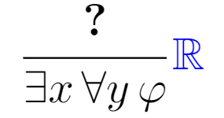

$$
\newcommand{\R}{\mathbb{R}}
\newcommand{\inferrule}[3][]{\frac{#2}{#3}\,{#1}}
$$

# Beyond $\ast$: Visualizing Quantifier Elimination for Real Arithmetic

**Abstract**: The existence of a quantifier elimination algorithm for real arithmetic is one of the foundational results that enables formal reasoning and verification of CPS. Most of the well-known algorithms for quantifier elimination are extremely complicated, too inefficient to be used on even the simplest of formulae, or both. This makes studying quantifier elimination algorithms difficult. This project aims to rectify this problem by providing a writeup and implementation of the Cohen-Hörmander algorithm along with some visualizations to aid understanding.

# Introduction

The modeling of cyber-physical systems (CPS), and the subsequent formal verification of the model, are made possible by a multitude of results. Foremost
among these is the development of a logic (such as differential dynamic logic) that can express desirable properties of a CPS as logical formulae, along
with a set of inference rules that can be used to construct proofs of these formulae. Manually constructing these computationally-verifiable proofs from the axioms
of all the formal logics involved would be far too painful even for simple CPS. It thus becomes important to seek methods of automating the proof construction.

While it is impossible for many useful logics to fully automate the proof construction process (CITE HERE), it is certainly possible to automate portions
of it. Rather surprisingly, a 1931 result by Tarski (CITE HERE), along with related more recent developments (CITE HERE), show that the entire proof construction
process can be automated once the desired goal has been reduced to proving a formula of real arithmetic. This result is absolutely foundational for CPS verification, both
from a theoretical and a practical perspective. The existence of an automatic verification procedure for formulae of real arithmetic allows one to abstract away the formal reasoning
process behind the real arithmetic proof goals, and simply give inference rules such as the following, which holds whenever $\bigwedge \Gamma \implies \bigvee \Delta$ is a valid
formula of real arithmetic (CITE HERE).

$$
\inferrule{\ast}{\,\,\Gamma \vdash \Delta\,\,}{\color{blue}{\R}}
$$

Practically speaking, the real arithmetic proof goals that result from attempts to prove properties of CPS are often prohibitively complex for manual methods.

Given the significance of this result, and the rather mysterious nature of the real arithmetic proof rule, the question "what is really going on here?" likely crosses many students' minds.
A little research would reveal a number of algorithms for automatically deciding the truth of a sentence of real arithmetic (called quantifier elimination (QE) algorithms), but many of the choices have significant disadvantages:

- **Tarski's original algorithm** was a very important theoretical breakthrough, but complicated and so inefficient that it isn't useful for anything besides theoretical purposes (CITE HANDBOOK). Given the complexity of this algorithm, understanding it would be difficult, and given the inefficiency, interaction with an implementation (which would be very useful for understanding) would not be feasible.
- **Cylindrical-Algebraic Decomposition (CAD)** is the state of the art when it comes to practical QE, so it doesn't suffer from the inefficiency problem of Tarski's algorithm (CITE HERE). However, it is incredibly complicated: so much so that it took experts in the field 30 years to produce a working implementation (CITE HERE). As such, it is likely not suitable for a student in an introductory CPS class.
- **Virtual substitution** is efficient (CITE HERE), and simple enough to be part of CMU's introductory 15-424 _Logical Foundations of Cyber-Physical Systems_ course. The only shortcoming of this algorithm is that it isn't complete, in the sense that there are theoretical limitations that prevent it from deciding the truth of arbitrary sentences of real arithmetic (CITE HERE). Understanding this algorithm is thus not equivalent to understanding what's going on behind the scenes of the $\R$ proof rule.

However, there is a (not too well-known) alternative that offers a reasonable balance: the **Cohen-Hörmander** algorithm (CITE ORIG HERE). It is simple enough to be described in full in this paper, complete in the sense that it can (in principle) decide the truth of any sentence of real arithmetic, and efficient enough to admit implementations that one can actually interact with. This work thus aims to introduce an audience of students taking introductory logic courses to real quantifier-elimination by providing a writeup, a number of visuals, and an interactive implementation of the Cohen-Hörmander algorithm.

## Related Work

Mention the CAD visualization guy.

# Background

## Real Arithmetic

Terms, connectives, quantifiers, and their meaning (in brief)

## Real Analysis/Algebra

IVT, polynomial stuff. Just state theorems, no proofs.

# The Algorithm

The first important observation that underlies the Cohen-Hörmander algorithm is that sentences of the form $\forall x\, \varphi$ or $\exists x\, \varphi$ are essentially assertions about the signs ($0$, positive, or negative) of polynomials. We build up to this realization from the following simple facts:
- Terms of first-order real arithmetic are polynomials in $x$.
- Atomic formulae in real arithmetic are equalities or inequalities between terms.
- Since terms are polynomials, this means that every atomic formula is of the form $p_1 \textsf{ CMP } p_2$, where $\textsf{CMP}$ is one of: $=$, $<$, $>$, $\leq$, $\geq$.
- The formula $p_1 \textsf{ CMP } p_2$ is equivalent to $p_1 - p_2 \textsf{ CMP } 0$ for any choice of $\textsf{CMP}$.
- $p_1 - p_2$ is also a polynomial, and therefore $p_1 - p_2 \textsf{ CMP } 0$ expresses something about the sign of a polynomial.

The quantifier-free formula $\varphi$ is thus (equivalent to) a propositional combination of a bunch of assertions about the signs of some finite set $S_\varphi$ of polynomials. In other words, if we know the signs of all the polynomials in $S_\varphi$ at some point $x$, we can decide whether $\varphi$ is true or false at $x$. Now, how often do the signs of the polynomials in $S_\varphi$ change? Only finitely often - any given polynomial can only potentially change sign at its roots. Polynomials (with the zero polynomial being an easy edge case) have only finitely many roots, and $S_\varphi$ is a finite set of polynomials. Therefore, if we can obtain information about the signs of the polynomials in $S_\varphi$ at each of the roots of the polynomials and the intervals between the roots, we effectively capture the signs of all the polynomials in $S_\varphi$ at every $x \in \mathbb{R}$ in a finite data structure. This is exactly the **sign matrix** data structure computed in the Cohen-Hörmander algorithm.

More formally, the rows of the sign matrix are indexed by the polynomials in $S_\varphi$. If $x_1, \dots, x_n$ are an exhaustive list of all the roots of the polynomials in $S_\varphi$ with $x_1 < x_2 < \cdots < x_n$, then the other dimension of the sign matrix is indexed by 

$$(-\infty, x_1), x_1, (x_1, x_2), x_2, \dots, (x_{n - 1}, x_n), x_n, (x_n, \infty)$$

i.e, the singleton sets at the roots and the intervals between them. The entry of the sign matrix at column $p \in S_\varphi$
and row $I$ is just the sign of $p$ on $I$. Note that the signs of all the polynomials are invariant on each interval, because
if a polynomial (or any continuous function, for that matter) changes sign on an interval, it must have a root in that interval.
But since $x_1, \dots, x_n$ is a list of ALL of the roots of the polynomials in $S_\varphi$, and no interval listed above
contains any of these points, this is not possible.

Here's an example of a sign matrix for the set of polynomials $\{p_1, p_2, p_3\}$,
where $p_1(x) = 4x^2 - 4$, $p_2(x) = (x + 1)^3$, and $p_3(x) = -5x + 5$.

$$
\begin{array}{cccccc}
    & (-\infty, x_1) & x_1 & (x_1, x_2) & x_2 & (x_2, \infty) \\
p_1 & + & 0 & - & 0 & + \\
p_2 & - & 0 & + & + & + \\
p_3 & + & + & + & 0 & -
\end{array}
$$

And here's an animation that illustrates the meaning of the sign matrix.

# Conclusion

# Deliverables

# References